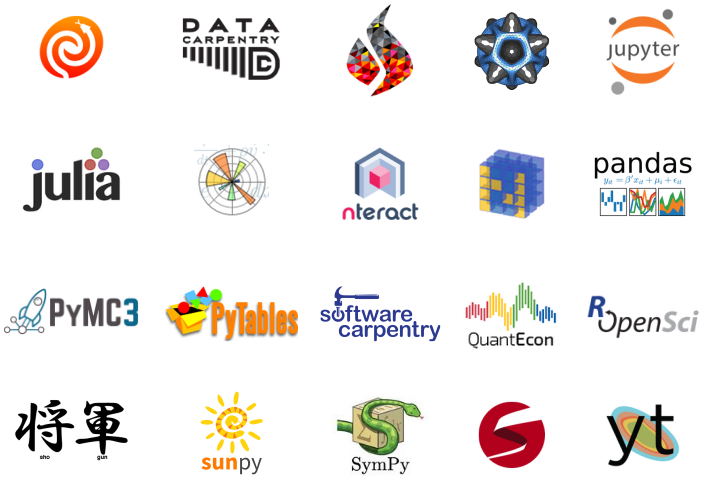

<!-- .slide: class="titleslide" -->

# NumFOCUS: Sustainability Project

## Matthew Turk

`mjturk@illinois.edu`
 

---

## Thanks!

Thanks for having me here.  This talk presents the work of many others,
especially Tracy Teal.

Also, a bunch of the advisory board members from this project are here.

---

## NumFOCUS Sustainability Project

I had to think really hard about how to present this project.  I'm no longer a
board member of NumFOCUS, and I don't know the current state of the project.

So let's travel back in time to the Summer of 2016, and I will describe what we wanted to happen...

---

> NumFOCUS is a 501(c)3 that supports and promotes world-class, innovative,
> open source scientific software and is the Fiscal Sponsor of 15 open source
> projects, providing a context for Projects to coordinate activities. 

(That number is now 28 as of the last time I checked.)

---

The project was initially conceived by board members Tracy Teal and Matthew Turk, in collaboration with NumFOCUS Executive Director Leah Silen and Josh Greenberg of the Sloan Foundation.

The proposal narrative itself can be found at [10.5281/zenodo.2651357](https://zenodo.org/record/2651357#.XQfSXEjYqt1).

---

## What We Saw

The NumFOCUS projects were gathered under a large umbrella, but the connective tissue was provided almost exclusively by grassroots efforts.

We identified that the projects were struggling from multiple similar, but non-identical, issues:a lack of coordination, no mechanism to gain inroads into the businesses that utilized their outputs, and an overall void where "product management" was concerned.

---

---

## Principal Goals

1. Connect the NumFOCUS Projects to each other to jointly develop strategies
   for partnering with industry.
2. Provide training on business and financial planning and marketing
   strategies, including effective communication.
3. Connect Project leads with people with relevant expertise and networks,
   including through training workshops and an Advisory Board.
4. Support infrastructure that would help the Projects more effectively manage
   finances and client and business relationships.

---

## Our Plan

1. Establish a sustainability Advisory Board
2. Hire a NumFOCUS Projects Director
3. Hold workshops
4. Develop guidelines
5. Measure success

---

## Our Big Product

"A guide, the Open Source Nurturing and Actionable Practices Kit (OSNAP kit),
will be designed as a "kickstart" for developing or building sustainability,
and will be accessible to both projects that are directly engaged with
through this grant as well as publicly available. This will be a living,
evolving resource for OSPs to foster better practices, including both
socially-relevant and technically-actionable materials (such as templates for
project governance documents, user and developer engagement, and devops
recipes and scripts). This will provide guidance to projects on what it is
they need to learn and where and how to get started, to overcome the current
challenge of project leads to find necessary information and resources."

---

## Outcomes: Business Partnerships

**Directly** connect projects with relevant business partners who may contribute to their long-term sustainability.  For instance:

 1. Connect infrastructure projects with product-focused industry partners
 2. Consulting services

We wanted to foster *genuine* relationships, either through memoranda of understanding for open-source contributions or fee/service-based consulting.

---

## Outcomes: Revenue Streams

We wanted to build methods for building revenue streams between industry and open source:

 1. Term-of-work relationships: donations of specific amounts tied to specific improvements ("$50,000 for development of new date time support" or "$250,000 to implement OpenMP array operations")
 2. Service Level Agreements (SLAs) that can be included in grants ("To support NumPy in your NSF grant, use this text and SLA to provide a portion of your grant funds to support ongoing development through fixed-price consulting services.")
 
Projects didn't know how
 

(It's probably worth unpacking some of the difficulties around that first item.)

---

## Outcomes: Social Change

By increasing awareness of the challenges of sustainability, socializing individuals and projects that rely on OSPs to contribute back in some way (consulting fees, line item support, software as a service, etc) can increase the likelihood of longer term sustainability paths being successful.

---

## (My) Lessons Learned

<ol>
<li class="fragment">"Data" has changed the game.  Things that corporations <i>value</i> are not trivially identifiable.</li>
<li class="fragment">"One size" barely fits most.  The NumFOCUS projects are different from other open source projects and different from <i>each other</i>.</li>
<li class="fragment">Corporate trajectories and relationships are emergent behavior, not governed by fundamental principles.</li>
</ol>

---

## Current State

#### The ecosystem has changed.

NumFOCUS is different.  There are new corporate and semi-corporate players in this space.  Old corporate partners have changed.

Our plan was change-resilient, but our implementation was not.
